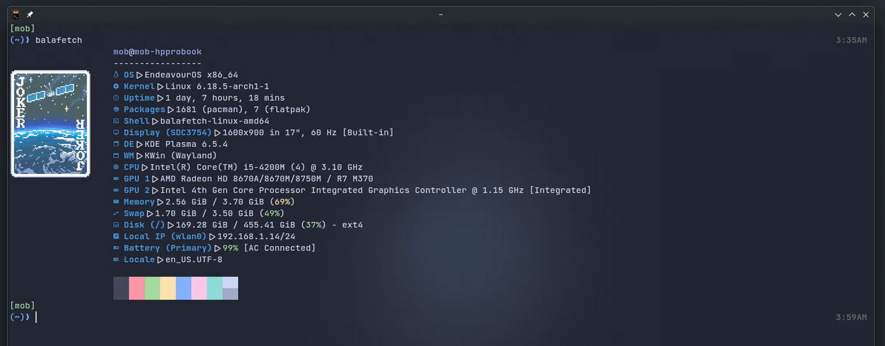
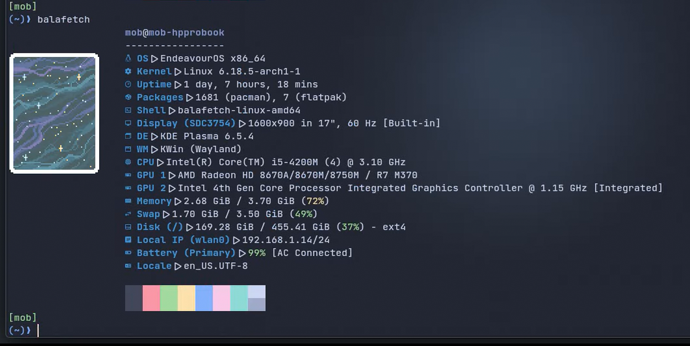
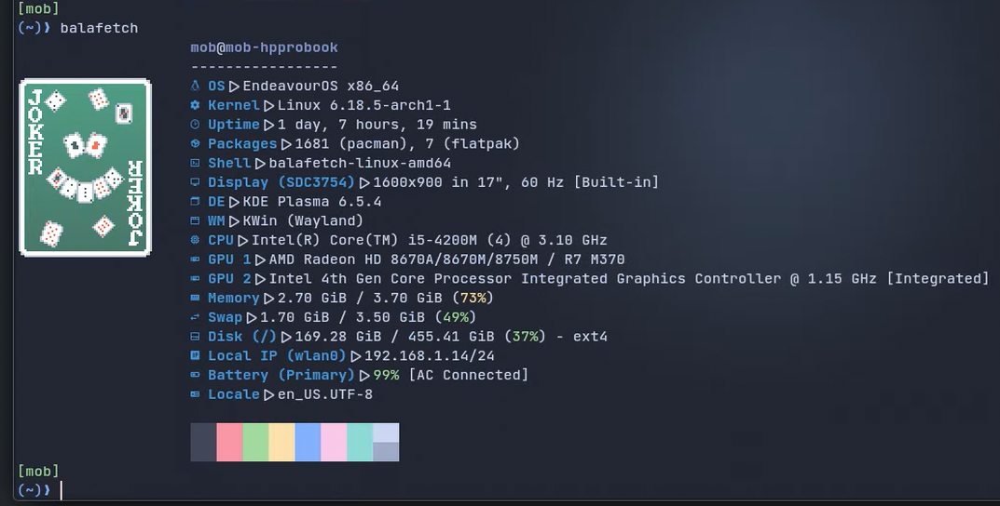
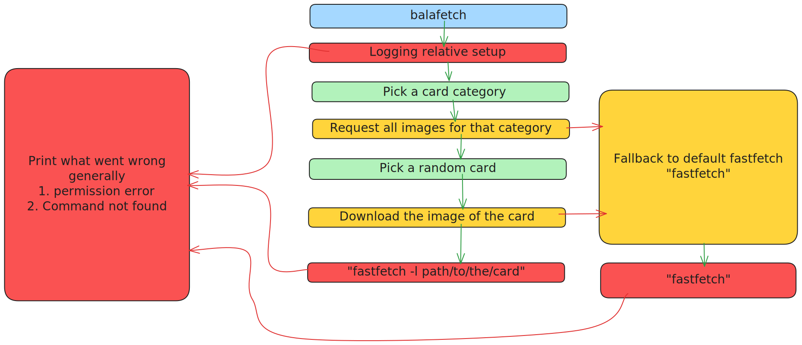

# balafetch






## Summary

balafetch is a lightweight wrapper for [fastfetch](https://github.com/fastfetch-cli/fastfetch) that displays your system information with a random [Balatro](https://www.playbalatro.com/) card as the logo. Each time you run it, balafetch fetches a random card from the Balatro fandom wiki (Jokers, Tarot Cards, Planet Cards, Spectral Cards, or Vouchers) and passes it to fastfetch for display. If anything goes wrong, it gracefully falls back to default fastfetch behavior.

## Table of Contents

- [Why?](#why)
- [Features](#features)
- [Prerequisites](#prerequisites)
- [Installation](#installation)
  - [Binary Installation](#binary-installation-recommended)
  - [Manual Installation](#manual-installation-from-source)
- [Usage](#usage)
- [How It Works](#how-it-works)
- [Troubleshooting](#troubleshooting)
  - [Common Issues](#common-issues)
  - [Advanced Usage/Scripting](#advanced-usagescripting)
- [Contributing](#contributing)
- [License](#license)
- [Credits](#credits)

---

## Why?

- balatro.
- boredom.

## Why should you use it?

No idea, but this shit is my new fastfetch.

## Features

- 🎴 Randomly displays Balatro cards from 5 different categories (Jokers, Spectral Cards, Vouchers, Planet Cards, Tarot Cards)
- 🪶 Lightweight - doesn't ship with card images or fastfetch binary
- 🔄 Automatic image cleanup after display
- 🛡️ Graceful fallback to default fastfetch on errors
- 🌐 Fetches fresh card images from the Balatro fandom wiki API

## Prerequisites

- **fastfetch** must be installed and available in your PATH
    - Install via your package manager or from [fastfetch releases](https://github.com/fastfetch-cli/fastfetch/releases)
    - Must be compiled with ImageMagick support for image display
- **Graphics-capable terminal emulator** (for displaying card images)
    - Supported terminals: Kitty, WezTerm, iTerm2, Konsole, Windows Terminal (with Sixel), or any terminal supporting Kitty/Sixel/iTerm graphics protocols
    - Fallback: ASCII art via Chafa if graphics protocols aren't supported
- **Internet connection** (for fetching card images)

## Installation

### Binary Installation (Recommended)

#### 1. Download the binary

Download the balafetch binary for your OS and architecture:

```bash
curl -O -L https://github.com/gitmobkab/balafetch/releases/download/{version}/balafetch-{os}-{arch}
```

Replace the following placeholders:
- `{version}` - The version you want (e.g., `v0.2.0`)
- `{os}` - Your operating system (`linux`, `darwin` for macOS, `windows`, `freebsd`)
- `{arch}` - Your CPU architecture (`amd64`, `arm64`, `arm`)

> [!NOTE]
> On Windows, you must add `.exe` to the filename

```bash
# For Windows amd64 (64-bit)
curl -O -L https://github.com/gitmobkab/balafetch/releases/download/{version}/balafetch-windows-amd64.exe
```

**Available OS/Architecture pairs:**
- `windows/amd64`
- `windows/arm64`
- `linux/amd64`
- `linux/arm64`
- `linux/arm`
- `darwin/amd64` (macOS Intel)
- `darwin/arm64` (macOS Apple Silicon)
- `freebsd/amd64`
- `freebsd/arm64`
- `freebsd/arm`

#### 2. Install the binary

**Linux/macOS/FreeBSD:**
```bash
# Make the binary executable
chmod +x balafetch-{os}-{arch}

# Move to a directory in your PATH for system-wide installation
sudo mv balafetch-{os}-{arch} /usr/local/bin/balafetch
```

> [!TIP]
> If you prefer to install balafetch only for the current user:
```bash
mv balafetch-{os}-{arch} ~/.local/bin/balafetch
```

**Windows:**
```powershell
# Rename the binary (if needed)
ren balafetch-windows-{arch}.exe balafetch.exe

# Move to a directory in your PATH (e.g., C:\Windows\System32 or add a custom directory to PATH)
move balafetch.exe C:\Windows\System32\
```

#### 3. Run it!

Start a new terminal and type:
```bash
balafetch
```

### Manual Installation (From Source)

If there's no pre-built binary for your platform, you can build balafetch yourself.

**Prerequisites:**
- [git](https://git-scm.com/) (to download the project)
- [Go](https://go.dev/) (to compile the project)

**Build instructions:**

```bash
# Clone the repository
git clone https://github.com/gitmobkab/balafetch.git
cd balafetch

# Build the project
go build ./cmd/balafetch/ -o balafetch

# Install (system-wide)
sudo mv balafetch /usr/local/bin/

# Or install for current user only
mv balafetch ~/.local/bin/
```

## Usage

Simply run:
```bash
balafetch
```

That's it! Each time you run it, you'll get a random Balatro card as your fastfetch logo.

## How It Works

> [!NOTE]
> To be very lightweight, balafetch doesn't ship with any Balatro card images nor the actual fastfetch binary. This means that in order to work, you at least need to have the fastfetch command available in your terminal.

When you run balafetch:

1. **Logging relative setup** - Initializes logging configuration
2. **Pick a card category** - Randomly selects from: `["Joker", "Spectral Card", "Vouchers", "Planet Card", "Tarot Card"]`
3. **Request all images** - Fetches all images for the selected category from the Balatro fandom API
4. **Pick a random card** - Selects one card at random from the fetched list
5. **Download the image** - Downloads the card image to your temporary folder as `balatro-{randomHash}.png`
6. **Execute fastfetch** - Runs `fastfetch -l path/to/card.png` with the downloaded image
7. **Cleanup** - Removes the temporary image file

Most operations are independent of balafetch itself and are bridged by your computer, internet availability/speed, hard drive speed, etc.

## Troubleshooting

balafetch isn't working? See the [balafetch troubleshooting documentation](docs/troubleshooting.md)

### Error Handling Flow

balafetch has intelligent fallback behavior to ensure you always get *some* output:



#### Error Types

**Fatal Errors** (red boxes) - Force balafetch to print an error and exit:
- Permission errors
- Command not found (fastfetch not installed)
- Logging setup failures

**Fallible Errors** (yellow boxes) - Recovered by falling back to default fastfetch:
- Failed to request images from API
- Failed to download selected card image

When a fallible error occurs, balafetch will automatically fall back to running `fastfetch` with default settings.

### Common Issues

**"command not found: fastfetch"**
- Make sure fastfetch is installed and in your PATH
- Try running `fastfetch` directly to verify installation

**No image appears / Falls back to default fastfetch**
- Check your internet connection
- The Balatro fandom API might be temporarily unavailable
- Check your temporary directory has write permissions

> [!NOTE]
> balafetch has a log file located in your home directory at `~/balafetch/balafetch.log`
> You can check what went wrong there if the logo is not a Balatro card

**Permission denied errors**
- Ensure balafetch has execute permissions: `chmod +x balafetch`
- Check that your temporary directory is writable

### Advanced Usage/Scripting

If you're building scripts around balafetch, you may want to handle different error codes. [See the Error Codes Documentation for details on all exit codes.](docs/errors_codes.md)

## Contributing

Contributions are welcome! Feel free to open issues or submit pull requests.

## License

Under the MIT License

## Credits

- [fastfetch](https://github.com/fastfetch-cli/fastfetch) - The awesome system information tool this wraps
- [Balatro](https://www.playbalatro.com/) - For being an incredible game
- Balatro Fandom Wiki - For providing the card images via their API

---

**Made with ❤️ and a deck of cards 🃏**