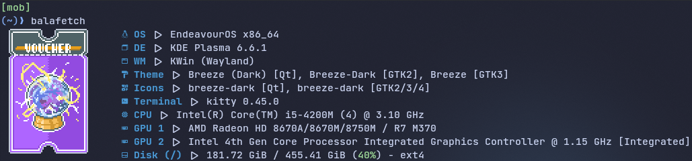
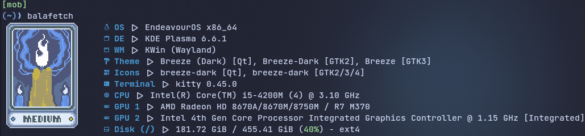
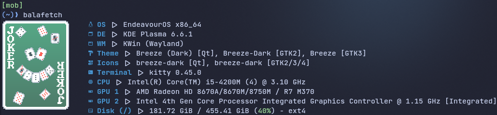
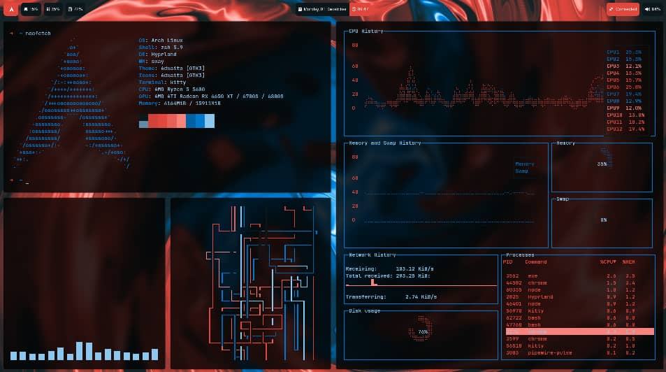
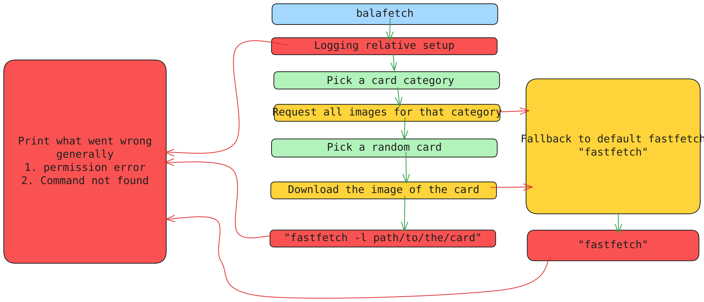

<h1 align="center">balafetch</h1>

<p align="center">
  
</p>

<p align="center">
  *the cards in the logo are unofficial cards made for balafetch logo, not actual Balatro cards*
</p>

<p align="center">
  
  
  
</p>


<table>
  <tr>
    <td></td>
    <td></td>
    <td></td>
  </tr>
  <tr>
    <td align="center">Example 1</td>
    <td align="center">Example 2</td>
    <td align="center">Example 3</td>
  </tr>
</table>

## Summary

balafetch is a lightweight wrapper for [fastfetch](https://github.com/fastfetch-cli/fastfetch) that displays your system information with a random [Balatro](https://www.playbalatro.com/) card as the logo. Each time you run it, balafetch fetches a random card from the Balatro fandom wiki (Jokers, Tarot Cards, Planet Cards, Spectral Cards, or Vouchers) and passes it to fastfetch for display. If anything goes wrong, it gracefully falls back to default fastfetch behavior.

## Table of Contents

- [Why?](#why)
- [Features](#features)
- [Prerequisites](#prerequisites)
- [Installation](#installation)
  - [Binary Installation](#binary-installation-recommended)
  - [Manual Installation](#manual-installation-from-source)
- [Usage](#usage)
- [How It Works](#how-it-works)
- [Troubleshooting](#troubleshooting)
  - [Common Issues](#common-issues)
  - [Advanced Usage/Scripting](#advanced-usagescripting)
- [Contributing](#contributing)
- [License](#license)
- [Credits](#credits)

---

## Why?

- balatro.
- boredom.

## Why should you use it?

Not long ago, i was looking at some rices on the hyprland discord server, and i came accross that beautiful balatro themed rice.



and i thought to myself, 
> **"this rice would be perfect if it add a balatro card as the logo in fastfetch"** 

so i decided to make it myself, and here we are.

## Features

- 🎴 Randomly displays Balatro cards from 5 different categories (Jokers, Spectral Cards, Vouchers, Planet Cards, Tarot Cards)
- 🪶 Lightweight - doesn't ship with card images or fastfetch binary
- 🔄 Automatic image cleanup after display
- 🛡️ Graceful fallback to default fastfetch on errors
- 🌐 Fetches fresh card images from the Balatro fandom wiki API

## Prerequisites

- **fastfetch** must be installed and available in your PATH
    - Install via your package manager or from [fastfetch releases](https://github.com/fastfetch-cli/fastfetch/releases)
    - Must be compiled with ImageMagick support for image display
- **Graphics-capable terminal emulator** (for displaying card images)
    - Supported terminals: Kitty, WezTerm, iTerm2, Konsole, Windows Terminal (with Sixel), or any terminal supporting Kitty/Sixel/iTerm graphics protocols
    - Fallback: ASCII art via Chafa if graphics protocols aren't supported
- **Internet connection** (for fetching card images)

## Installation

### Binary Installation (Recommended)

#### 1. Download the binary

**Linux/macOS/FreeBSD:**

Download the latest version:
```bash
curl -OL https://github.com/gitmobkab/balafetch/releases/latest/download/balafetch-{os}-{arch}
```

Download a specific version (e.g., V0.6.0):
```bash
curl -OL https://github.com/gitmobkab/balafetch/releases/download/V0.6.0/balafetch-{os}-{arch}
```

**Windows (PowerShell):**

Download the latest version for your architecture:
```powershell
# For Windows amd64 (64-bit)
Invoke-WebRequest -Uri "https://github.com/gitmobkab/balafetch/releases/latest/download/balafetch-windows-amd64.exe" -OutFile "balafetch-windows-amd64.exe"

# For Windows arm64 (ARM 64-bit)
Invoke-WebRequest -Uri "https://github.com/gitmobkab/balafetch/releases/latest/download/balafetch-windows-arm64.exe" -OutFile "balafetch-windows-arm64.exe"
```

Download a specific version (e.g., V0.8.0):
```powershell
# For Windows amd64
Invoke-WebRequest -Uri "https://github.com/gitmobkab/balafetch/releases/download/V0.8.0/balafetch-windows-amd64.exe" -OutFile "balafetch-windows-amd64.exe"
```

**Windows (cmd.exe):**

```cmd
# For Windows amd64
curl -OL https://github.com/gitmobkab/balafetch/releases/latest/download/balafetch-windows-amd64.exe

# For Windows arm64
curl -OL https://github.com/gitmobkab/balafetch/releases/latest/download/balafetch-windows-arm64.exe
```

> [!NOTE]
> The capital `V` in the version is important: use `V0.8.0`, not `v0.8.0`.

Replace the following placeholders:
- `{version}` - The version you want (e.g., `V0.4.0`, `V0.8.0`, etc.).
- `{os}` - Your operating system (`linux`, `darwin` for macOS, `windows`, `freebsd`)
- `{arch}` - Your CPU architecture (`amd64`, `arm64`, `arm`)

> [!IMPORTANT]
> For whatever reason, balafetch use capital `V` rather than `v` for versioning, so make sure to use `{version}` with a capital V when downloading. (e.g., `V0.4.0` instead of `v0.4.0`)


**Available OS/Architecture pairs:**
- `windows/amd64`
- `windows/arm64`
- `linux/amd64`
- `linux/arm64`
- `linux/arm`
- `darwin/amd64` (macOS Intel)
- `darwin/arm64` (macOS Apple Silicon)
- `freebsd/amd64`
- `freebsd/arm64`
- `freebsd/arm`

**Versioning:**
You can find the latest version number on the [balafetch GitHub Releases](https://github.com/gitmobkab/balafetch/releases) page.

you can see the latest release version in the badge at the top of this README as well.
[See the CHANGELOG for details on what's new in each version.](CHANGELOG.md)

**Release Page:**
You can also visit the [balafetch releases page](https://github.com/gitmobkab/balafetch/releases) to manually download the binary for your platform.

#### 2. Verify the binary (optional but recommended)
To ensure the integrity of the downloaded binary, you can verify its SHA256 checksum against the value provided in the release notes.

**Get the expected checksum from the release notes**

See the release notes for the version you downloaded, and find the SHA256 checksum for your specific OS/architecture binary (available in the release notes since v0.4.0).

**Linux/macOS/FreeBSD:**
```bash
# Example: expected checksum from release notes
bccd4f65...07b  balafetch-linux-amd64

# Compute the checksum of the downloaded file
# For Linux/macOS amd64:
sha256sum balafetch-linux-amd64
# For Linux arm64:
sha256sum balafetch-linux-arm64
# For macOS amd64:
sha256sum balafetch-darwin-amd64

# Compare the computed checksum with the expected value
# If they match, the file is valid. If not, do not use the file and try downloading again.
```

**Windows (PowerShell):**
```powershell
# Example: expected checksum from release notes
bccd4f65...07b  balafetch-windows-amd64.exe

# Compute the checksum of the downloaded file
# For Windows amd64:
(Get-FileHash balafetch-windows-amd64.exe -Algorithm SHA256).Hash
# For Windows arm64:
(Get-FileHash balafetch-windows-arm64.exe -Algorithm SHA256).Hash

# Compare the computed checksum with the expected value
# If they match, the file is valid. If not, do not use the file and try downloading again.
```


#### 3. Install the binary

**Linux/macOS/FreeBSD:**
```bash
# Make the binary executable
chmod +x balafetch-{os}-{arch}

# Move to a directory in your PATH for system-wide installation
sudo mv balafetch-{os}-{arch} /usr/local/bin/balafetch
```

> [!TIP]
> If you prefer to install balafetch only for the current user:
```bash
mv balafetch-{os}-{arch} ~/.local/bin/balafetch
```

**Windows (PowerShell):**
```powershell
# Move to a directory in your PATH (e.g., C:\Windows\System32 or add a custom directory to PATH)
# Windows will find balafetch-windows-{arch}.exe or balafetch.exe
Move-Item balafetch-windows-{arch}.exe C:\Windows\System32\balafetch.exe
```

Alternatively, rename and move in separate steps:
```powershell
Rename-Item balafetch-windows-{arch}.exe balafetch.exe
Move-Item balafetch.exe C:\Windows\System32\
```

#### 4. Run it!

Start a new terminal and run:
```bash
balafetch
```

To verify the installation worked and see available options:
```bash
balafetch --help
```

### Manual Installation (From Source)

If there's no pre-built binary for your platform, you can build balafetch yourself.

**Prerequisites:**
- [git](https://git-scm.com/) (to download the project)
- [Go](https://go.dev/) (to compile the project)

**Linux/macOS/FreeBSD:**

```bash
# Clone the repository
git clone https://github.com/gitmobkab/balafetch.git
cd balafetch

# Build the project (or use ./compile.sh for all platforms)
go build ./cmd/balafetch/ -o balafetch

# Install (system-wide)
sudo mv balafetch /usr/local/bin/

# Or install for current user only
mv balafetch ~/.local/bin/
```

**Windows (PowerShell):**

```powershell
# Clone the repository
git clone https://github.com/gitmobkab/balafetch.git
cd balafetch

# Build using compile.bat (recommended — includes version info and builds all platforms)
.\compile.bat .\cmd\balafetch\ 0.8.0

# Or build manually for current platform (version info will be "dev")
go build .\cmd\balafetch\ -o balafetch.exe

# Move to a directory in your PATH (e.g., C:\Windows\System32)
Move-Item balafetch.exe C:\Windows\System32\balafetch.exe -Force
```

> [!TIP]
> Use `compile.bat` to build binaries for all platforms and properly inject version information. This is recommended over manual `go build` for release builds.

> [!NOTE]
> On Windows, you may need administrator privileges to move files to `C:\Windows\System32\`. Alternatively, add a custom directory to your PATH environment variable.

## Usage
```bash
balafetch - The stupid balatro flavoured fastfetch wrapper
Usage: balafetch [OPTIONS] [CARD CATEGORY | ALIAS]
Options:
  -h, --help           Show help information
  -t, --timeout int    Set the timeout for API requests in seconds (default 20)
  -u, --update         Update balafetch to the latest version from GitHub
  -v, --version        Show version information
      --version-full   Show detailed version information
Available categories (aliases in parentheses):
 - jokers (joker)
 - tarot cards (tarot, tarots)
 - planet cards (planet, planets)
 - spectral cards (spectral, spectrals)
 - vouchers (voucher)
```

### Self-Update

To update balafetch to the latest version without manual downloading:

```bash
balafetch --update
# or
balafetch -u
```

This will automatically:
1. Check the latest release on GitHub
2. Download the appropriate binary for your OS/architecture
3. Verify the binary integrity via SHA256 checksum
4. Replace your current balafetch executable

> [!NOTE]
> Self-update requires write permissions to your balafetch installation directory. On Linux/macOS, system-wide installs may require elevated privileges (`sudo balafetch --update`).

You can check the [CLI documentation](docs/cli.md) for more details on usage.


## How It Works

> [!NOTE]
> To be very lightweight, balafetch doesn't ship with any Balatro card images nor the actual fastfetch binary. This means that in order to work, you at least need to have the fastfetch command available in your terminal.

When you run balafetch:

1. **Logging relative setup** - Initializes logging configuration
2. **Pick a card category** - Randomly selects between: 
    - jokers
    - spectral cards
    - vouchers
    - planet cards
    - "tarot cards

3. **Request all images** - Fetches all images for the selected category from the Balatro fandom API
4. **Pick a random card** - Selects one card at random from the fetched list
5. **Download the image** - Downloads the card image to your temporary folder as `balatro-{randomHash}.png`
6. **Execute fastfetch** - Runs `fastfetch -l path/to/card.png` with the downloaded image
7. **Cleanup** - Removes the temporary image file

Most operations are independent of balafetch itself and are bridged by your computer, internet availability/speed, hard drive speed, etc.

## Troubleshooting

balafetch isn't working? See the [balafetch troubleshooting documentation](docs/troubleshooting.md)

### Error Handling Flow

balafetch has intelligent fallback behavior to ensure you always get *some* output:



#### Error Types

**Fatal Errors** (red boxes) - Force balafetch to print an error and exit:
- Permission errors
- Command not found (fastfetch not installed)
- Logging setup failures
- Invalid usage (unsupported arguments) [since v0.3.0]

**Fallible Errors** (yellow boxes) - Recovered by falling back to default fastfetch:
- Failed to request images from API
- Failed to download selected card image

When a fallible error occurs, balafetch will automatically fall back to running `fastfetch` with default settings.

### Common Issues

**"command not found: fastfetch"**
- Make sure fastfetch is installed and in your PATH
- Try running `fastfetch` directly to verify installation

**No image appears / Falls back to default fastfetch**
- Check your internet connection
- The Balatro fandom API might be temporarily unavailable
- Check your temporary directory has write permissions

> [!NOTE]
> balafetch has a log file located in your home directory at `~/balafetch/balafetch.log`
> You can check what went wrong there if the logo is not a Balatro card

**Permission denied errors**
- Ensure balafetch has execute permissions: `chmod +x balafetch`
- Check that your temporary directory is writable

### Advanced Usage/Scripting

If you're building scripts around balafetch, you may want to handle different error codes. [See the Error Codes Documentation for details on all exit codes.](docs/errors_codes.md)

## Contributing

Contributions are welcome! Feel free to open issues or submit pull requests.

check the [contributing guidelines](CONTRIBUTING.md) for more details on contribution before submitting.

## License

Under the MIT License

## Credits

- [fastfetch](https://github.com/fastfetch-cli/fastfetch) - The awesome system information tool this wraps
- [Balatro](https://www.playbalatro.com/) - For being an incredible game
- Balatro Fandom Wiki - For providing the card images via their API

---

**Made with ❤️ and a deck of cards 🃏**
