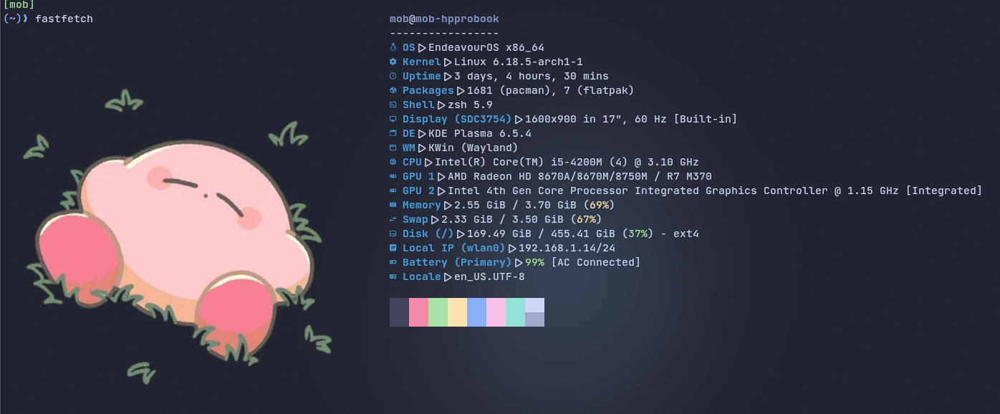

# Balafetch Troubleshooting Guide

> [!NOTE]
> If you're looking for a list of all balafetch error codes, [see the error codes documentation](errors_codes.md)

## Table of Contents

- [Error Types](#error-types)
- [Balafetch Log File Location](#balafetch-log-file-location)
- [Troubleshooting Fatal Errors](#troubleshooting-fatal-errors)
- [Troubleshooting Fallible Errors](#troubleshooting-fallible-errors)

## Error Types

While running balafetch, you might encounter 2 types of errors:

### Fatal Errors
These are errors that can't be resolved by balafetch and force it to print the error to the terminal and exit immediately.

### Fallible Errors
A fallible error is an error that stops balafetch from reaching its goal but can be resolved by balafetch automatically. When this happens, balafetch falls back to default fastfetch and logs the error.

---

A **Fatal Error** forces balafetch to exit right away.

A **Fallible Error**, if resolved, will be logged in the balafetch log file located at `{HOME_FOLDER}/balafetch/balafetch.log`.

## Balafetch Log File Location

The log file is located at:

**Windows:**
```
C:\Users\{YourUsername}\balafetch\balafetch.log
```

**Linux:**
```
/home/{username}/balafetch/balafetch.log
# or simply
~/balafetch/balafetch.log
```

**macOS:**
```
/Users/{username}/balafetch/balafetch.log
# or simply
~/balafetch/balafetch.log
```

**FreeBSD:**
```
/home/{username}/balafetch/balafetch.log
# or simply
~/balafetch/balafetch.log
```

## Troubleshooting Fatal Errors

To this day, there are only two known Fatal Errors:

### 1. Permission Denied on Log File

```bash
Unable to open log file: open {HomeFolder}/balafetch/balafetch.log: permission denied
```

**Example:**
```bash
Unable to open log file: open /home/mob/balafetch/balafetch.log: permission denied
```

**Explanation:**

Balafetch logs every fallible error inside of this file. When you launch balafetch, it first tries to open this file for possible future logs. To do so:
- The `balafetch/` folder must have **read**, **write**, and **execute** permissions for the user
- The `balafetch/balafetch.log` file must have **read** and **write** permissions for the user

**Fix:**

Check the permissions for both and update them.

**On Linux/macOS/FreeBSD:**
```bash
# Check current permissions
ls -l ~/balafetch/
ls -l ~/balafetch/balafetch.log

# Fix permissions
chmod u=rwx ~/balafetch/
chmod u=rw ~/balafetch/balafetch.log
```

**On Windows:**
```powershell
# Check permissions
icacls %USERPROFILE%\balafetch
icacls %USERPROFILE%\balafetch\balafetch.log

# Grant full control to current user
icacls %USERPROFILE%\balafetch /grant %USERNAME%:F
icacls %USERPROFILE%\balafetch\balafetch.log /grant %USERNAME%:RW
```

### 2. Fastfetch Not Installed

```bash
Fastfetch not installed in your system
```

**Explanation:**

This happens because there's no command named `fastfetch` in your system.

**Fix:**

Download and install the fastfetch binary on your system. Fastfetch is available on almost all Linux distros via their package manager.

**Installation examples:**
```bash
# Debian/Ubuntu
sudo apt install fastfetch

# Arch Linux
sudo pacman -S fastfetch

# Fedora
sudo dnf install fastfetch

# macOS
brew install fastfetch

# Windows
winget install fastfetch
```

Or download manually from [fastfetch releases](https://github.com/fastfetch-cli/fastfetch/releases).

## Troubleshooting Fallible Errors

After running balafetch, in case of a non-fatal error scenario, you'll have one of two outputs:

### 1. Success ✅

Fastfetch displays with a Balatro card as the logo!


In this case, you're good to go. This is the intended behavior.

### 2. Fallback to Default Fastfetch ⚠️

Fastfetch displays but **without** a Balatro card as the logo.



This happens only when balafetch encounters a fallible error.

Most of the time, fallible errors are temporary or caused by your internet connection (timeout, Balatro API might be down, slow connection, etc.).

### How to Debug Fallible Errors

To troubleshoot these errors, check the `balafetch.log` file. See [Balafetch Log File Location](#balafetch-log-file-location) for the path.

Opening the file, you'll find a bunch of lines for each fallible error that balafetch encountered. They're prefixed by the date and time to help you navigate faster.

Each entry follows the pattern:

```
Date Time [ Error Code: n ]
Date Time <Error Message>
```

**Example:**

```
2026/01/18 01:21:57 [ Error Code: 1 ]
2026/01/18 01:21:57 Get "https://balatrogame.fandom.com/api.php?action=query&format=json&imlimit=max&prop=images&titles=Tarot+Cards": dial tcp: lookup balatrogame.fandom.com: Temporary failure in name resolution
```

In this case, this happens when you're not connected to the internet.

### Common Fallible Error Scenarios

**Error Code 1** (Internet Related):
- Check your internet connection
- Verify DNS is working
- Retry later - the API might be temporarily down

**Error Code 2** (Unexpected API Response):
- This is likely a bug
- Open an issue on the [balafetch repository](https://github.com/gitmobkab/balafetch/issues)

**Error Code 3** (File Related):
- Check that your temporary directory has write permissions
- Ensure you have enough disk space (images are small, but just in case)

For detailed fixes for each error code, see the [Error Codes Documentation](errors_codes.md).